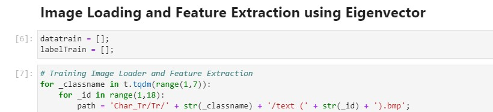
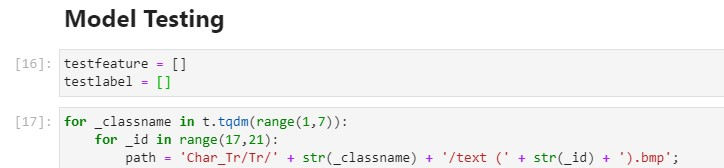
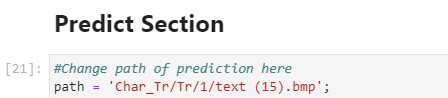
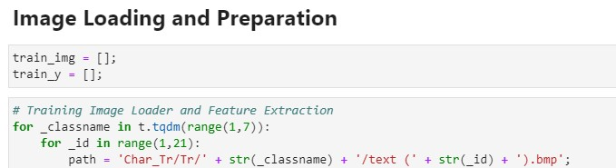
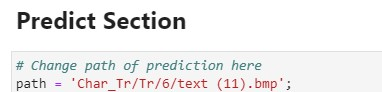

# Image Toture

## สมาชิกกลุ่ม
- นางสาววรางคณา สุขพาสน์เจริญ 62070166 (IT)
- นายจิรายุ จุลกทัพพะ 62070234 (DSBA)
- นายสิทธิวิชัย เหล็กจีน 62070278 (DSBA)
- นายอภิพล ด้วงเพียร 62070285 (DSBA)

---

## การเปลี่ยน Path รูป Project 2

เปลี่ยน Train Dataset ที่ Cell ที่ 2 ในหัวข้อ Image Loading and Feature Extraction using Eigenvector ตัวแปร path 

เปลี่ยน Test Dataset ที่ Cell ที่ 2 ในหัวข้อ Model Testing ตัวแปร path

เปลี่ยน path รูปที่จะทำการ predict ที่ ตัวแปร path หัวข้อ Predict Section

เปลี่ยน path รูป Test ของ TA ที่ ตัวแปร mypath หัวข้อ TA Test Data

---

## การเปลี่ยน Path รูป Project 3
เปลี่ยน Dataset ที่ใช้ train และ test ที่ Cell ที่ 2 ในหัวข้อ Image Loading and Preparation ตัวแปร path

เปลี่ยน path รูปที่จะทำการ predict ที่ ตัวแปร path หัวข้อ Predict Section

เปลี่ยน path รูป Test ของ TA ที่ ตัวแปร mypath หัวข้อ TA Test Data

---

## การรันโปรแกรม

สามารถ import เข้า jupyter notebook และรันได้เลย